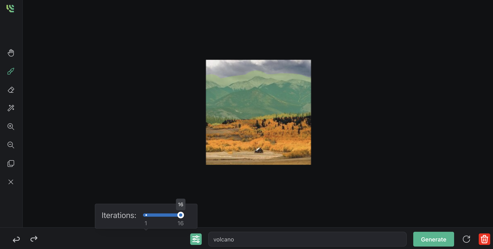
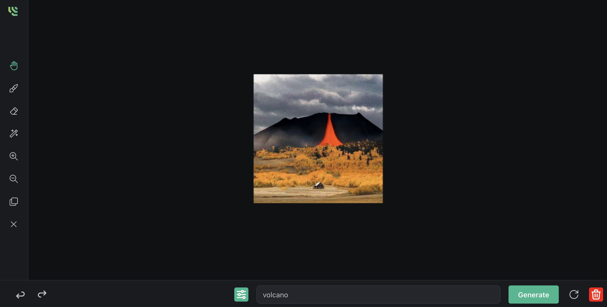
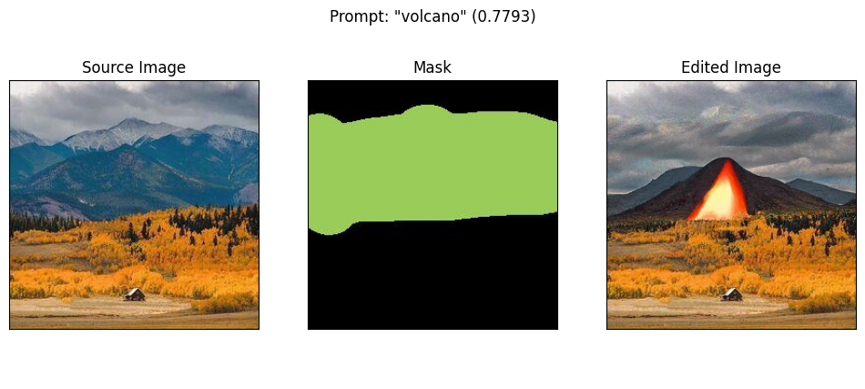

<h1 align="center">BlendAI</h1>

<div align="center">
	<a href="#overview">Overview</a>
  <span> • </span>
    	<a href="#setup">Setup</a>
  <span> • </span>
    	<a href="#first-steps">Beam SDK</a>
  <p></p>
</div> 

<p align="center" float="left">
    
    
</p>
<p align="center">
    An interactive application for editing images using <a href='https://arxiv.org/pdf/2111.14818.pdf'>Blended Diffusion.</a>
</p>

## Overview

Blended diffusion combines a pretratined language-image model with a denoising diffusion probabilistic model to create a text-driven image replacement algorithm. The original source code for the model can be found <a href="https://github.com/omriav/blended-diffusion">here.</a> With BlendAI, we provide an interface for generating prompt-based image edits and deploy the model as a serverless webhook on the cloud using the <a href="https://www.beam.cloud/">Beam SDK.</a>
<p align="center">
    
</p>

## Setup

To build the frontend and run the application server, execute the following
```sh
yarn install
yarn build
cd server
source venv/bin/activate # create venv with python3 -m venv venv
pip3 install -r requirements.txt
python3 app.py
```

## Beam SDK

To deploy serverless webhook on Beam, first install the <a href="https://docs.beam.cloud/getting-started/installation">Beam CLI.</a>
Then create a <a href="https://www.beam.cloud/dashboard/volumes">persistant volume</a> mounted at `/checkpoints` to upload the weights, which are available for download <a href="https://drive.google.com/file/d/145NpznbcwMeoX-v8U-bUpu8eXILh3n7Z/view">here (~2GB)</a>.
```sh
cd blended-diffusion-model
beam deploy app.py
```
By default, the model is deployed on an Nvidia A10 GPU, though this is configurable in `/blended-diffusion-model/app.py`.
For the application to call the webhook, we need to specify two environment variables in `/.env`. See `/server/app.py` for request format.
```py
BEAM_APP_ID="" # Application ID
BEAM_AUTH="" # (Basic) Auth header for webhook, see example curl command
```